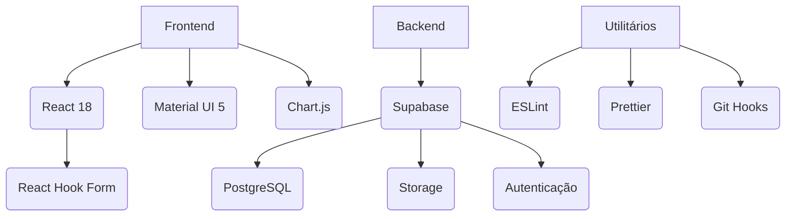

# Oz Store - Painel de Venda de Scripts para FiveM/SAMP/MTA  

  

**O marketplace definitivo para scripts de FiveM, SAMP e MTA**  

## 🔥 Destaques da Oz Store  
- **Catálogo exclusivo** com os melhores scripts do mercado  
- **Sistema antifraude** integrado em todas as transações  
- **Suporte 24/7** para compradores e desenvolvedores  
- **Atualizações gratuitas** para produtos adquiridos  

## 🛠 Painel Administrativo  

### 📦 Gerenciamento de Produtos  
- Cadastro completo com preview em tempo real  
- Controle de versões dos scripts  
- Sistema de tags para organização  

### 📊 Business Intelligence  
- Dashboard de vendas em tempo real  
- Relatórios de produtos mais vendidos  
- Controle de comissões para afiliados  

### 🔒 Segurança  
- Autenticação em dois fatores  
- Logs detalhados de todas as ações  
- Backup automático diário  

## 🚀 Tecnologias Utilizadas  


## 📌 Próximas Atualizações  
- [x] Sistema de licenciamento  
- [ ] Integração com Discord  
- [ ] Painel do revendedor  
- [ ] API pública para desenvolvedores  

## 💰 Modelo de Negócios  
- **Comissão por venda**: 15% sobre cada transação  
- **Planos premium**: Destaque para produtos  
- **Sistema de assinaturas**: Acesso a scripts exclusivos  

> "A Oz Store nasceu para revolucionar o mercado de scripts, trazendo segurança e profissionalismo para esta comunidade"  
> **Fundador da Oz Store**  

📧 Contato: contato@ozstore.com  
🌐 Site Oficial: [https://ozstore.com](https://ozstore.com)  
📱 Discord: [Oz Store Oficial](https://discord.gg/ozstore)  

```bash
# Comando para iniciar o projeto
npm run start:ozstore
```
